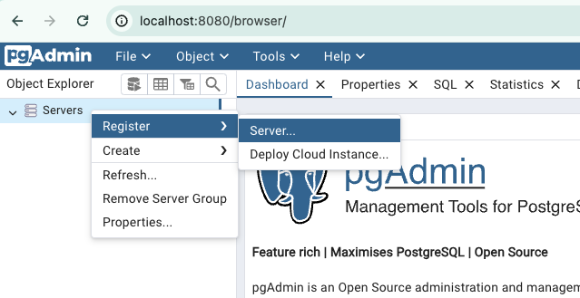
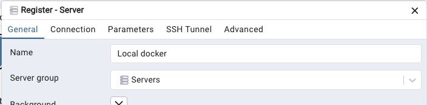
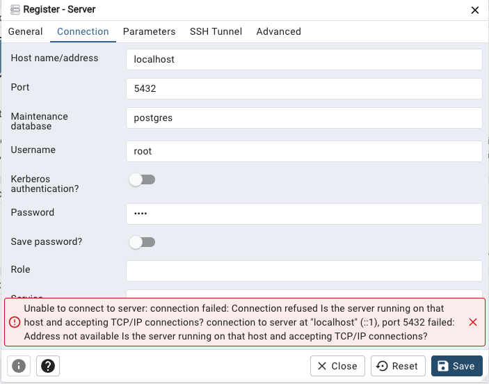
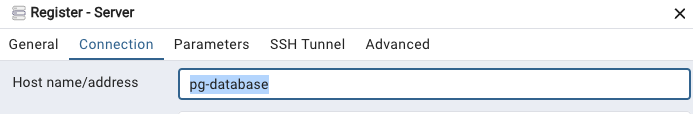
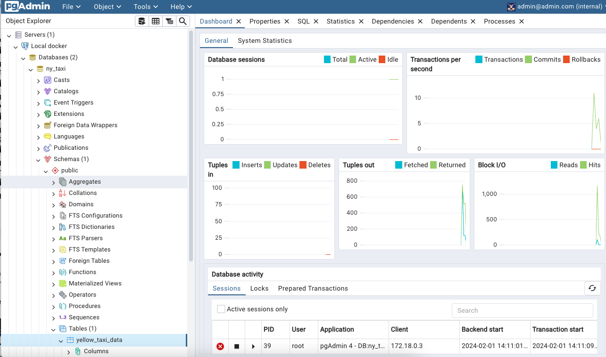
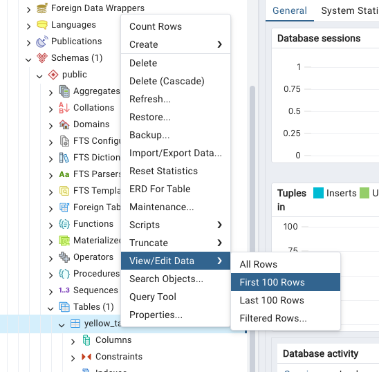
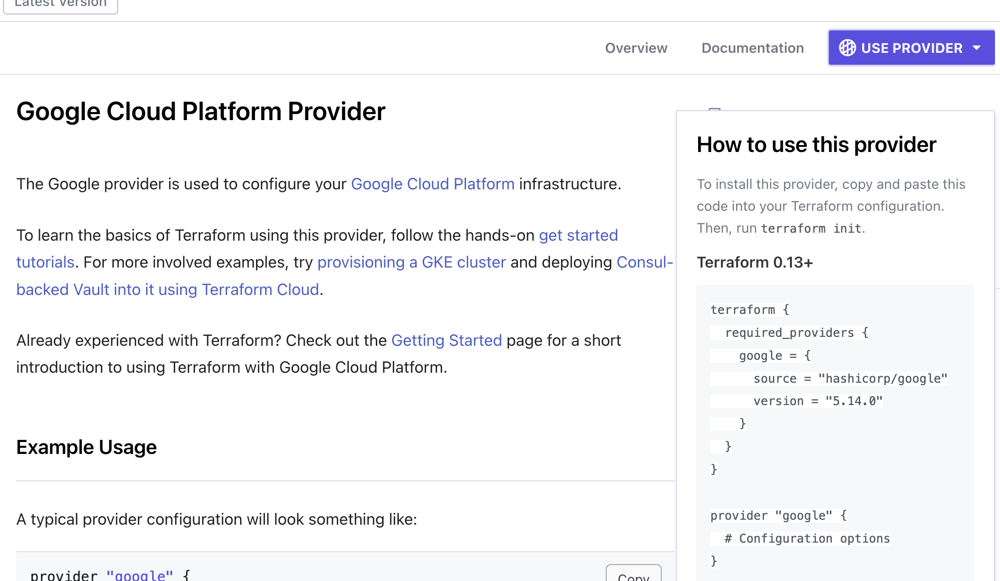

# NOTES

# Intro to docker

[Youtube video](https://youtu.be/EYNwNlOrpr0?feature=shared)

Main benefits:

- Isolation. We can install things on containers running on our local computer that don’t conflict with our actual local installations
- Reproducibility. We can use the image on our local computer, on a VM, on someone else’s computer and we will get exactly the same environment and results
- Integration tests via CI/CD (tbd how docker is used for this) - e.g. github actions, jenkins
- Running on the cloud e.g. Kubernetes
- Spark
- Serverless - Processing data

## Commands

Install the VSCode extension

### Check that docker works

```bash
docker run hello-world
```

### Run an image and do something

`docker run` means to run the image

`-it` means to run in interactive mode

`ubuntu` is the name of the image we want to run

`bash` is the command we want to run

```bash
docker run -it ubuntu bash
```

everything after the image name is a parameter

If we do something stupid, we can just `exit` and create another container by running the same command

## Image with a tag

```bash
docker run -it python:3.9
```

We enter directly into a python interpreter

What if we want to enter a bash terminal on this image so that we can e.g. install pandas?

### Overriding entrypoint

```bash
docker run -it --entrypoint=bash python:3.9

$ pip install pandas
$ python 
>>> import pandas as pd
```

But this only works once because it’s an isolated environment. So we should do this in a Dockerfile to define a new image where we can install the packages we need

### Dockerfile

```docker
FROM python:3.9

RUN pip install pandas

ENTRYPOINT [ "bash" ]
```

If we have this in our current directory, then when we build the image we just specify `.` as the path, otherwise we need to point the build to the path to find the Dockerfile

We also have to specify a tag `-t` which consists of `imagename:tag`

```bash
docker build -t test:pandas .
```

Now we can use it

```bash
docker run -it test:pandas

$ python
>>> import pandas as pd
```

### Copying files

Let’s create a local file `pipeline.py` with some code and run it on the docker image

For that we need to copy it so we add the following commands to our docker file (after `RUN`)

```docker
WORKDIR /app
COPY pipeline.py pipeline_on_machine.py
```

`WORKDIR` will create a folder called `app` and cd into this directory

`COPY` will copy the file `pipeline.py` from our local to the container and call it `pipeline_on_machine.py` (it could have had the same name but i wanted to clarify which is which)

Now we can rebuild

```docker
FROM python:3.9

RUN pip install pandas

WORKDIR /app
COPY pipeline.py pipeline.py

ENTRYPOINT [ "bash" ]
```

```bash
docker build -t test:pandas . # will overwrite the image
docker run -it test:pandas

$ pwd
/app

$ ls
pipeline.py

$ python pipeline.py
```

### Running code

We don’t actually want to go into the container and run it manually, we want the dockerfile to do it, so we need to change the entrypoint

```docker
ENTRYPOINT [ "python", "pipeline.py" ]
```

We could just run it as a command like `RUN python pipeline.py` and then we could keep bash as our entrypoint for the interactive mode, but then we wouldn’t see the output and we couldn’t parameterize it and pass args from the CLI (see below)

### Arguments

If we want to pass arguments to the command, we can do it like so

`pipeline.py`

```python
import sys
import pandas as pd

print(sys.argv)

day = sys.argv[1]  # First argument
# Do some stuff

print(f"Job finished successfully for day = {day}!")
```

```bash
docker build -t test:pandas .
docker run test:pandas 2021-01-15

['pipeline.py', '2021-01-15']
Job finished successfully for day = 2021-01-15!
```

Note: We don’t need the -it here since it will run the script and then exit the image anyway

# Setting up postgres image

[Youtube video](https://youtu.be/2JM-ziJt0WI?feature=shared)

```bash
docker run -it \
    -e POSTGRES_USER="root" \
    -e POSTGRES_PASSWORD="root" \
    -e POSTGRES_DB="ny_taxi" \
    -v $(pwd)/data/ny_taxi_postgres_db:/var/lib/postgresql/data \
    -p 5432:5432 \
    postgres:13
```

- Environment variables are set using the `-e` option, one for each variable
- Volumes are used to map a local folder on the host machine to a folder on the container. We need to store files for the postgres DB and we also want to persist the data we create
    - Create the local folder `data/ny_taxi_postgres_db`
    - Map it to a path on the container using the `-v` option (we need the full path or use `$(pwd)` to add the current directory)
- The port is needed to send requests to our DB on the container. We map a port locally to a port on the container (local_port:container_port)

Now if we run this command in the terminal (we have to be in the `01-docker` directory) we see a lot of new folders and files in the `data/ny_taxi_postgres_db` folder

## Accesing the postgres DB

Install the pgcli package on your host machine

```bash
python -m venv .venv
source .venv/bin/activate
pip install pgcli
```

Check the options with `pgcli --help`. Use the config above in the docker run command to fill in the port, username, database and, when prompted, the password

```bash
pgcli -h localhost -p 5432 -u root -d ny_taxi
```

Try it out:
- `\dt` list tables
- `SELECT 1;`

## Downloading taxi data

We're using the data from [here](https://www.nyc.gov/site/tlc/about/tlc-trip-record-data.page), just one month from 1 year on Yellow cabs. Since they changed the format to parquet recently, the zoomcamp recommended taking their csv from their github so it's easier to follow along with the steps. There's information on the schema etc on the above page if you scroll down

Download the data

```bash
wget https://github.com/DataTalksClub/nyc-tlc-data/releases/download/yellow/yellow_tripdata_2021-01.csv.gz

gunzip yellow_tripdata_2021-01.csv.gz
```

Have a look at it (you can exit `less` with `q`)
```bash
less yellow_tripdata_2021-01.csv
```

Or save a sample and open it in Excel
```bash
head -n 100 yellow_tripdata_2021-01.csv > yellow_tripdata_2021-01_head.csv
```

Check how many lines the data has (1369766 rows)

```bash
wc -l yellow_tripdata_2021-01.csv
```

## Upload data to postgres

See the notebook `upload_taxi_data_to_postgres.ipynb`

You might need to `pip install pandas` (I created a `requirements.txt` with the packages I had to install)

# pgAdmin

[Youtube video](https://youtu.be/hCAIVe9N0ow?feature=shared)

Since interacting with the DB via the pgcli is a bit inconvenient, we can also use a GUI. One example is pgAdmin, and we will set it up using a docker container. 

## Set up pgAdmin container
Google "pgAdmin docker" and you'll reach the [downloads page](https://www.pgadmin.org/download/) from which you can select "Container" and then go to the [image on dockerhub](https://hub.docker.com/r/dpage/pgadmin4/) and see the variables [here](https://www.pgadmin.org/docs/pgadmin4/latest/container_deployment.html)


```bash
docker run -it \
  -e PGADMIN_DEFAULT_EMAIL="admin@admin.com" \
  -e PGADMIN_DEFAULT_PASSWORD="root" \
  -p 8080:80 \
  dpage/pgadmin4
```

The options are similar for the cli above. The email and password are needed to log into the interface, then we do port mapping, and finally the image name that we took from docker hub

## Connect pgAdmin to postgres DB

Once we run that, we can see the UI at `localhost:8080` and we just login with the username and password above and set up the server

1. Register the server


2. Give it a name


3. Set up the connection to match our postgres image


Uh-oh. So the connection didn't work because it is looking in the "localhost" of the machine with pgadmin for the postgres db, but they are actually on two separate containers. So we need "networks" to fix that. I think that basically means, connecting the two machines so that they can communicate with each other.

First, stop the pgadmin and postgres containers via the terminal and look up "docker network create" for info on how to do it

## Create a docker network

```bash
docker network create pg-network
```

The last option is just the name we want to give it.

Then we just pass the option `--network pg-network` and give a name to each container with `--name something` to the other docker commands, i.e.

```bash
docker run -it \
    -e POSTGRES_USER="root" \
    -e POSTGRES_PASSWORD="root" \
    -e POSTGRES_DB="ny_taxi" \
    -v $(pwd)/data/ny_taxi_postgres_db:/var/lib/postgresql/data \
    -p 5432:5432 \
    --network pg-network \
    --name pg-database \
    postgres:13
```

```bash
docker run -it \
  -e PGADMIN_DEFAULT_EMAIL="admin@admin.com" \
  -e PGADMIN_DEFAULT_PASSWORD="root" \
  -p 8080:80 \
  --network pg-network \
  --name pg-admin \
  dpage/pgadmin4
```

Now we just reconnect to pgAdmin and, in the connection, instead of localhost, we give it the name of the container with the DB i.e. `pg-database`



Now we can explore more easily e.g. we can see the tables in the schema



If we right click, we can view the first 100 rows (this will open a sql tab with the query)



We can also write our own queries by opening Tools > Query Tool

# Dockerising the pipeline script

We previously did some data ingestion in the `upload_taxi_data_to_postgres.ipynb` notebook. 

## Create the data ingestion script

Let's move this to an `ingest_data.py` script. We can drop the table with `DROP TABLE public.yellow_taxi_data;` in pgAdmin.

Now to run it

```bash
python ingest_data.py \
    --user=root \
    --password=root \
    --host=localhost \
    --port=5432 \
    --db=ny_taxi \
    --table_name=yellow_taxi_data \
    --csv_url=https://github.com/DataTalksClub/nyc-tlc-data/releases/download/yellow/yellow_tripdata_2021-01.csv.gz \
    --csv_name=yellow_tripdata_2021-01.csv
```

## Update the docker file for data ingestion

That works, so let's update the Dockerfile to run the code. We need to add the extra packages we used like wget, sqlalchemy, psycopg2, and change the name of the script

```docker
FROM python:3.9

RUN apt-get install wget

RUN pip install pandas sqlalchemy psycopg2

WORKDIR /app
COPY ingest_data.py ingest_data.py

ENTRYPOINT [ "python", "ingest_data.py" ]
```

## Build and run the ingestion container

We can build the image

```bash
docker build -t ingest_data:v0.0.1 .
```

And run it with our args. We have to make sure we're running it on the network, and that we pass the name `pg-database` as the host name to the script, otherwise it cannot access our postgres instance if we just say `localhost`

NOTE: The args like --network and --name have to come before the image name as these are options for the docker run, whereas the CLI args for the python script have to go after the name of the image


```bash
docker run -it \
    --network pg-network \
    --name ingest-data \
    ingest_data:v0.0.1 \
        --user=root \
        --password=root \
        --host=pg-database \
        --port=5432 \
        --db=ny_taxi \
        --table_name=yellow_taxi_data \
        --csv_url=https://github.com/DataTalksClub/nyc-tlc-data/releases/download/yellow/yellow_tripdata_2021-01.csv.gz \
        --csv_name=yellow_tripdata_2021-01.csv
```

NOTE: If we need to see the containers and stop them 

```bash
docker ps
docker kill some-id-of-the-container
```

#### Sidenote from the instructor

If it's slow to download the csv, we can also pass our local files to the container in case we already downloaded the csv before. For that, we need to spin up a http server and use our IP address (because localhost for the docker container is its own localhost, not our host machine).

We can spin up a http server in our current directory and access it at http://localhost:8000/ to see the files

```bash
python -m http.server
```

We need our ip address (`en0` for wifi, `en1` for wired)

```bash
ipconfig getifaddr en0
```
 
We can check it by going to `http://<our-ip-address>:8000/` and checking that we see the same files

Then we would pass `--csv_url=http://<our-ip-address>:8000/yellow_tripdata_2021-01.csv` to our docker run command instead

# Docker compose

Docker compose should already come pre-installed with docker desktop. We can check it with

```bash
docker-compose
```

We create our containers in a `docker-compose.yaml` file

```yaml
services:
  pgdatabase:
    image: postgres:13
    environment:
      - POSTGRES_USER=root
      - POSTGRES_PASSWORD=root
      - POSTGRES_DB=ny_taxi
    volumes:
      - ./data/ny_taxi_postgres_db:/var/lib/postgresql/data:rw
    ports:
      - 5432:5432
  pgadmin:
    image: dpage/pgadmin4
    environment:
      - PGADMIN_DEFAULT_EMAIL=admin@admin.com
      - PGADMIN_DEFAULT_PASSWORD=root
    ports:
      - 8080:80
```

Some things to note:
- We don't need the full path to the local data/ny_taxi_postgres_db
- Since we define these two services together, they are automatically part of the same network so we don't need to define a network

We can run it with `docker-compose up`

NOTE: If you get an error with "The CSRF session token is missing", make sure you close the pgAdmin tab before running the docker-compose up command [source](https://stackoverflow.com/a/65099126) or just refresh that tab

NOTE: I added the volume `./data/pgadmin:/var/lib/pgadmin` for the pgadmin container to persist the server creation (the first time you login you have to create it, but then it will be persisted)

To clean up the containers

```bash
docker-compose down
```

To run in detached mode (so we can still use that terminal)

```bash
docker-compose up -d
```

To stop and start the containers (without removing them, as we do with `down`)

```bash
docker compose start
docker compose stop
```

# SQL

First let's add the information about the taxi zones from the [data page](https://www.nyc.gov/site/tlc/about/tlc-trip-record-data.page) -> Taxi Zone Maps and Lookup Tables -> Taxi Zone Lookup Table (CSV)

I did this in the `get_zones_data.ipynb` (I ran `docker-compose up` first)

This `zones` data contains the LocationIDs that map to the PU (pick-up) and DO (drop-off) LocationIDs in the `yellow_taxi_data` table

NOTE: I messed up the ingestion conversion of the datetime columns. I didn't convert them on the header so the table schema had them as text which meant I couldn't do things like DATE_TRUNC. In order to speed up the recreation of these tables, I added an extra step to the docker compose file and fixed the ingestion script, including the zones data. It can be commented out of the docker compose if need be.

Some examples

- Information about the zones and drop-offs/pick-ups
```sql
SELECT TPEP_PICKUP_DATETIME,
	TPEP_DROPOFF_DATETIME,
    DATE_TRUNC('DAY', TPEP_PICKUP_DATETIME) as pu_day,
	DATE_TRUNC('DAY', TPEP_DROPOFF_DATETIME) as doff_day,
	TOTAL_AMOUNT,
	PUP."Borough" || ' / ' || PUP."Zone" AS PUP_LOC,
	DOFF."Borough" || ' / ' || DOFF."Zone" AS DOFF_LOC
FROM YELLOW_TAXI_DATA Y
INNER JOIN ZONES PUP ON Y."PULocationID" = PUP."LocationID"
INNER JOIN ZONES DOFF ON Y."DOLocationID" = DOFF."LocationID"
```

- Number of drop_offs per day
```sql
SELECT 
	CAST(TPEP_DROPOFF_DATETIME AS DATE) as doff_day,
	COUNT(*) as n_trips,
    MAX(total_amount) as max_amount,
    MAX(passenger_count) as max_passengers
FROM YELLOW_TAXI_DATA Y
INNER JOIN ZONES PUP ON Y."PULocationID" = PUP."LocationID"
INNER JOIN ZONES DOFF ON Y."DOLocationID" = DOFF."LocationID"
GROUP BY 1
ORDER BY "doff_day" ASC
```

- Number of drop_offs per day and location
```sql
SELECT 
	CAST(TPEP_DROPOFF_DATETIME AS DATE) as doff_day,
    DOFF."Borough" || ' / ' || DOFF."Zone" AS DOFF_LOC,
	COUNT(*) as n_trips,
    MAX(total_amount) as max_amount,
    MAX(passenger_count) as max_passengers
FROM YELLOW_TAXI_DATA Y
INNER JOIN ZONES PUP ON Y."PULocationID" = PUP."LocationID"
INNER JOIN ZONES DOFF ON Y."DOLocationID" = DOFF."LocationID"
GROUP BY 1, 2
ORDER BY doff_day ASC, DOFF_LOC ASC
```


# Terraform

Terraform is infrastructure as a service. It's basically a way of managing cloud resources through a script so that we can reproduce it, share it, version control it, etc

It has a lot of [providers](https://registry.terraform.io/browse/providers) e.g GCP

## Key commands

- init - Get me the providers I need
- plan - What am I about to do?
- apply - Do what is in the tf files
- destroy - Remove everything in the tf files

## Service account

It's like a regular account, but never meant to be logged into

[Youtube video](https://www.youtube.com/watch?v=Y2ux7gq3Z0o&list=PL3MmuxUbc_hJed7dXYoJw8DoCuVHhGEQb&index=12)

NOTE: Create a project if you haven't already

1. Go to [GCP](console.cloud.google.com) -> IAM and admin -> [Service accounts](https://console.cloud.google.com/iam-admin/serviceaccounts?organizationId=0&project=dtc-de-course-412716)
2. Click "Create Service Account"

- Give it a name e.g terraform-runner
- Grant access in step 2
  - We will create a storage bucket so Cloud Storage > Storage Admin (just scroll down)
  - We will create a BQ dataset so BigQuery > BigQuery Admin

In the real world, we would restrict the access as much as possible e.g. only create and destroy permissions

If we find we need to give more access later, we can do it from the [IAM section](https://console.cloud.google.com/iam-admin/iam?organizationId=0&project=dtc-de-course-412716) and just click "Edit principal" next to our service account
- Add Compute Engine > Admin

- Click Service account > Click the ellipsis next to our service account and ["Manage Keys"](https://console.cloud.google.com/iam-admin/serviceaccounts/details/102389994510037182928/keys?organizationId=0&project=dtc-de-course-412716) > Add Key > Create New > JSON

- Save that JSON file somewhere and add it to .gitignore if it's in a repo e.g. `terraform/keys/service-account.json`

## Example with GCP

Install the Terraform VSCode extension (the one by HashiCorp)

[Install Terraform](https://developer.hashicorp.com/terraform/tutorials/aws-get-started/install-cli)

Google "terraform google provider" and you'll find [this page](https://registry.terraform.io/providers/hashicorp/google/latest/docs#example-usage). You'll see a button in the top right "USE PROVIDER" which will show a pop up of an example we can use



We can copy that along with the suggested config to `main.tf`

```terraform
terraform {
  required_providers {
    google = {
      source  = "hashicorp/google"
      version = "5.14.0"
    }
  }
}

provider "google" {
  # Configuration options
  project = "my-project-id"
  region  = "us-central1"
}
```

NOTE: We can format the file by running `terraform fmt`

Now we need our project ID from GCP (Cloud Overview -> Dashboard -> Project ID)

We should add our service account either by setting the credentials argument e.g.

```terraform
provider "google" {
  # Configuration options
  credentials = "./keys/service_account.json"
  project     = "dtc-de-course-412716"
  region      = "us-central1"
}
```

Or by setting the environment variable `export GOOGLE_CREDENTIALS="/full/path/to/creds.json"`

Let's set it up:

```bash
terraform init
```

We should add `.terraform/` to our gitignore, but we should leave the lock file as this will help with reproducibility

### Setting up a GCS bucket

We can google it again and we will use [this example](https://registry.terraform.io/providers/hashicorp/google/latest/docs/resources/storage_bucket#example-usage---life-cycle-settings-for-storage-bucket-objects)

```terraform
resource "google_storage_bucket" "demo-bucket" {
  # "name" needs to be unique across all of GCP
  name          = "dtc-de-course-412716-terra-bucket"
  location      = "US"
  force_destroy = true

  lifecycle_rule {
    condition {
      age = 1 # days
    }
    action {
      type = "AbortIncompleteMultipartUpload"
    }
  }
}
```
- "google_storage_bucket" is a resource type
- "demo-bucket" is the name of the resource
- The "name" of the bucket must be unique across all of GCP, so using the project ID can help since it's unique
- "age" is in days

Now we check what would happen if we ran this

```bash
terraform plan
```

If we're happy with the proposed plan (we can also check the defaults that we didn't set like storage class), then we can run

```bash
terraform apply
```

I also added the .tfstate files to the .gitignore

And once we're ready to remove the resources, we can destroy them (this uses the .tfstate file so if we don't have this we might have to destroy them manually)

```bash
terraform destroy
```

Now the .tfstate file is empty