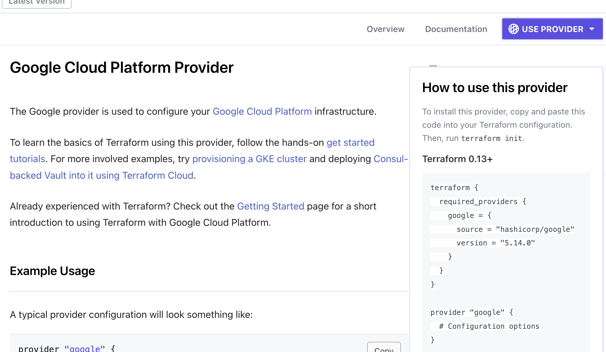

# Terraform

Terraform is infrastructure as a service. It's basically a way of managing cloud resources through a script so that we can reproduce it, share it, version control it, etc

It has a lot of [providers](https://registry.terraform.io/browse/providers) e.g GCP

## Key commands

- init - Get me the providers I need
- plan - What am I about to do?
- apply - Do what is in the tf files
- destroy - Remove everything in the tf files

## Service account

It's like a regular account, but never meant to be logged into

[Youtube video](https://www.youtube.com/watch?v=Y2ux7gq3Z0o&list=PL3MmuxUbc_hJed7dXYoJw8DoCuVHhGEQb&index=12)

NOTE: Create a project if you haven't already

1. Go to [GCP](console.cloud.google.com) -> IAM and admin -> [Service accounts](https://console.cloud.google.com/iam-admin/serviceaccounts?organizationId=0&project=dtc-de-course-412716)
2. Click "Create Service Account"

- Give it a name e.g terraform-runner
- Grant access in step 2
  - We will create a storage bucket so Cloud Storage > Storage Admin (just scroll down)
  - We will create a BQ dataset so BigQuery > BigQuery Admin

In the real world, we would restrict the access as much as possible e.g. only create and destroy permissions

If we find we need to give more access later, we can do it from the [IAM section](https://console.cloud.google.com/iam-admin/iam?organizationId=0&project=dtc-de-course-412716) and just click "Edit principal" next to our service account
- Add Compute Engine > Admin

- Click Service account > Click the ellipsis next to our service account and ["Manage Keys"](https://console.cloud.google.com/iam-admin/serviceaccounts/details/102389994510037182928/keys?organizationId=0&project=dtc-de-course-412716) > Add Key > Create New > JSON

- Save that JSON file somewhere and add it to .gitignore if it's in a repo e.g. `terraform/keys/service-account.json`

## Example with GCP

Install the Terraform VSCode extension (the one by HashiCorp)

[Install Terraform](https://developer.hashicorp.com/terraform/tutorials/aws-get-started/install-cli)

Google "terraform google provider" and you'll find [this page](https://registry.terraform.io/providers/hashicorp/google/latest/docs#example-usage). You'll see a button in the top right "USE PROVIDER" which will show a pop up of an example we can use



We can copy that along with the suggested config to `main.tf`

```terraform
terraform {
  required_providers {
    google = {
      source  = "hashicorp/google"
      version = "5.14.0"
    }
  }
}

provider "google" {
  # Configuration options
  project = "my-project-id"
  region  = "us-central1"
}
```

NOTE: We can format the file by running `terraform fmt`

Now we need our project ID from GCP (Cloud Overview -> Dashboard -> Project ID)

We should add our service account either by setting the credentials argument e.g.

```terraform
provider "google" {
  # Configuration options
  credentials = "./keys/service_account.json"
  project     = "dtc-de-course-412716"
  region      = "us-central1"
}
```

Or by setting the environment variable `export GOOGLE_CREDENTIALS="/full/path/to/creds.json"`

Let's set it up:

```bash
terraform init
```

We should add `.terraform/` to our gitignore, but we should leave the lock file as this will help with reproducibility

### Setting up a GCS bucket

We can google it again and we will use [this example](https://registry.terraform.io/providers/hashicorp/google/latest/docs/resources/storage_bucket#example-usage---life-cycle-settings-for-storage-bucket-objects)

```terraform
resource "google_storage_bucket" "demo-bucket" {
  # "name" needs to be unique across all of GCP
  name          = "dtc-de-course-412716-terra-bucket"
  location      = "US"
  force_destroy = true

  lifecycle_rule {
    condition {
      age = 1 # days
    }
    action {
      type = "AbortIncompleteMultipartUpload"
    }
  }
}
```
- "google_storage_bucket" is a resource type
- "demo-bucket" is the name of the resource
- The "name" of the bucket must be unique across all of GCP, so using the project ID can help since it's unique
- "age" is in days

Now we check what would happen if we ran this

```bash
terraform plan
```

If we're happy with the proposed plan (we can also check the defaults that we didn't set like storage class), then we can run

```bash
terraform apply
```

I also added the .tfstate files to the .gitignore

And once we're ready to remove the resources, we can destroy them (this uses the .tfstate file so if we don't have this we might have to destroy them manually)

```bash
terraform destroy
```

Now the .tfstate file is empty

### Setting up a BQ dataset

We can grab an example from [the docs](https://registry.terraform.io/providers/hashicorp/google/latest/docs/resources/bigquery_dataset#example-usage---bigquery-dataset-basic)

The only required field seems to be "dataset_id". Also the default location is US, which we might want to change for EU. We also set ["delete_contents_on_destroy"](https://registry.terraform.io/providers/hashicorp/google/latest/docs/resources/bigquery_dataset#delete_contents_on_destroy) to true to delete the tables inside the dataset when we destroy

```terraform
resource "google_bigquery_dataset" "demo-dataset" {
  dataset_id                 = "demo_dataset_terra"
  location                   = "EU"
  delete_contents_on_destroy = true
}
```

## Terraform variables

Let's create a `variables.tf` file

I won't copy them all here but the approach is

1. Create a variable

```terraform
variable "credentials_filename" {
  description = "Credentials file"
  type        = string
  default     = "./keys/service_account.json"
}
```

2. Use it with `var.my_variable_name`

```terraform

provider "google" {
  # Configuration options
  credentials = var.credentials_filename
  project     = "some-project"
  region      = "EU"
}
```