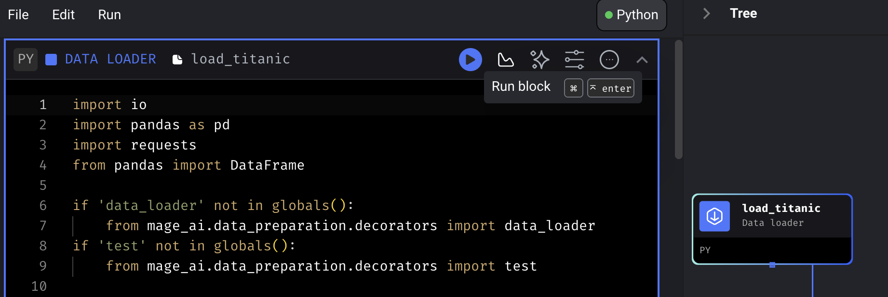

# NOTES

# Orchestration


- Extract: NYC taxi data
- Transform: Data cleaning, transformation, partitioning
- Load: Data into Postgres, BigQuery, GCS

## What is orchestration?

Data orchestration is about management of scheduling, triggering, monitoring and resource allocation

Every workflow (DAG) requires a sequential set of steps (tasks)

## What is Mage?

An open source pipeline tool for orchestrating, transforming and integrating data


## Configuring Mage

NOTE: Matt provided a completed Mage instance in [Github](https://github.com/mage-ai/mage-zoomcamp/tree/solutions) for later reference

Go to the ["Let's get started" section](https://github.com/mage-ai/mage-zoomcamp/tree/solutions?tab=readme-ov-file#lets-get-started) of the github repo for the setup commands. 

Basically we clone the mage-zoomcamp repo (I put mine in the parent folder, next to my de-zoomcamp) and run the docker-compose file to set up a mage instance in a container

NOTE: If we need the latest docker image (e.g. if we're being prompted to update Mage in the UI), we can do 

```bash
docker pull mageai/mageai:latest
```

Once we're done creating our image, if we go to `localhost:6789` we see the local Mage instance that we created


- `magic_zoomcamp` is our project
- `example_pipeline` is an example pipeline that was in the docker-compose yaml of the Mage repo we cloned

### Navigating in Mage

- Go to the sidebar > Pipelines to see the list of pipelines we have
- Click `example_pipeline` to see the tree view of the pipeline
- Go back to the sidebar and we now see an option for "Edit Pipeline"


- From there we can see the code used for each block. We can also see a list of files on the top right, these are saved in a folder on our local in the mage-zoomcamp repo under the project name. We can also see the "Current Blocks" tab

- If we click on the load data block and click "Run", this will get the data from the URL shown in the code



- We can run the rest of the blocks (or we can go to the bottom, click the 3 dots and select run upstream blocks). Note: the last block exports data, and this is saved outside of the project i.e. in the root of mage-zoomcamp

## Connecting to postgres

We have a postgres instance running and we want to be able to connect to it

Go to the mage [overview](http://localhost:6789/overview), open the sidebar -> Files to edit the files we have in our project. Go to `io_config.yaml` and add a new section for the dev connection to postgres

```yaml
dev:
  POSTGRES_CONNECT_TIMEOUT: 10
  POSTGRES_DBNAME: "{{ env_var('POSTGRES_DBNAME') }}"
  POSTGRES_SCHEMA: "{{ env_var('POSTGRES_SCHEMA') }}"
  POSTGRES_USER: "{{ env_var('POSTGRES_USER') }}"
  POSTGRES_PASSWORD: "{{ env_var('POSTGRES_PASSWORD') }}"
  POSTGRES_HOST: "{{ env_var('POSTGRES_HOST') }}"
  POSTGRES_PORT: "{{ env_var('POSTGRES_PORT') }}"
```

Mage config uses jinja templating for environment vars. Since we pass our env vars to the postgres docker (by specifying an env_file, `.env`) this should work

Now we create a new pipeline -> Standard (batch) -> Click Edit -> Pipeline Settings and change the name to test_config

Click on our new pipeline -> Edit pipeline -> Add a Data Loader -> SQL data loader -> call it test_postgres

Inside the block, select "Connection" -> PostgreSQL, "Profile" -> dev, Tick the box for Raw SQL (this means that whatever is inside the block is executed as sql)

Now let's test it with 

```sql
SELECT 1;
```

That works. Now we need to ingest data

## Ingesting data into postgres

We need a new pipeline, we'll call this api_to_postgres. 

Create a data loader -> Python -> API. You can see the code needed [here](https://github.com/mage-ai/mage-zoomcamp/blob/solutions/magic-zoomcamp/data_loaders/load_nyc_taxi_data.py)

Create a transformer (default) e.g. to drop rows with 0 passengers

Create an exporter (python -> postgres) to save our data

```python
@data_exporter
def export_data_to_postgres(df: DataFrame, **kwargs) -> None:
    schema_name = 'ny_taxi'  # Specify the name of the schema to export data to
    table_name = 'yellow_taxi_data'  # Specify the name of the table to export data to
    config_path = path.join(get_repo_path(), 'io_config.yaml')
    config_profile = 'dev'

    with Postgres.with_config(ConfigFileLoader(config_path, config_profile)) as loader:
        loader.export(
            df,
            schema_name,
            table_name,
            index=False,  # Specifies whether to include index in exported table
            if_exists='replace',  # Specify resolution policy if table name already exists
        )
```

And we can add a SQL data loader as we did before to check it

```sql
SELECT * FROM ny_taxi.yellow_taxi_data LIMIT 10;
```

## Connecting to GCP

- Create a GCS bucket via cloud.console.google.com
- Copy the titanic csv file there
- Create a service account with "Owner" role
- Move it to our mage-zoomcamp repo main directory. This is mounted as a volume to /home/src on our mage instance (see the docker compose yaml)
- Go to mage, io_config.yaml, and provide the path to the service account under "GOOGLE_SERVICE_ACC_KEY_FILEPATH"

Now we can test it with a data loader block -> Python -> Google Cloud Storage
- Give it the bucket name
- Give it the name of the file
- Run it

## Loading data to GCP

We can create a new pipeline and we want to reuse one of the steps from before (load_api_data). We can open up the files on the left and drag it in from the data_loaders folder

We can also drag over the transform_test_data block and connect them by dragging a line between them in the pipeline tree

Now we can add a Python -> GCS Data Exporter. We can save it to "nyc_taxi_data.parquet" and Mage will infer that it is a parquet file

### Partitioning the data

Since it's not best practice to just upload one massive file, we can partition the data using pyarrow (defined in the docker file)

We create a generic data exporter and use the following code:

```python
import pyarrow as pa
import pyarrow.parquet as pq
import os

if 'data_exporter' not in globals():
    from mage_ai.data_preparation.decorators import data_exporter

# Path to service account
os.environ["GOOGLE_APPLICATION_CREDENTIALS"] = "/home/src/dtc-de-course-412716-a149a90e1534.json"

# GCS bucket
bucket_name = 'mage-de-zoomcamp-ajones'

# GCP project
project_id = "dtc-de-course-412716"

# Partitioning will create a folder with this name in GCS
table_name = 'nyc_taxi_data'

# GCS Path
root_path = f"{bucket_name}/{table_name}"

@data_exporter
def export_data(data, *args, **kwargs):
  # Create a date column to partition on. We'll end up with one parquet file per day in the folder above
  data["tpep_pickup_date"] = data["tpep_pickup_datetime"].dt.date

  # We need to make a pyarrow table
  table = pa.Table.from_pandas(data)

  # And initialise the GCS filesystem client
  gcs = pa.fs.GcsFileSystem()

  # Write to GCS
  pq.write_to_dataset(
      table,
      root_path=root_path,
      partition_cols=["tpep_pickup_date"],
      filesystem=gcs
  )
```

### Saving to BQ

To save the data to BQ, we create a new pipeline to load the data again and clean the column names (lower case, underscores, no spaces)

Then we create a data exporter -> SQL. Connect it to BQ -> default and pass in a dataset name (schema) and a table name. We then just have to do this to save all the data to BQ

```sql
SELECT * FROM {{ df_1 }}
```

`df_1` is the output of the previous steps in the pipeline. If we go to BQ we will see our dataset and table there

### Other functionality

Matt also talked about Variables to parameterise a pipeline and Backfilling, where you can set up to run a pipeline for some previous dates (only works if you're using the execution date as a variable in the pipeline, really)

## Deploying Mage

For notes on deploying mage, see the [DE Zoompcap repo](https://github.com/DataTalksClub/data-engineering-zoomcamp/tree/main/02-workflow-orchestration#227----deployment-optional)

First, check we have terraform installed

```bash
terraform --help
```

Then initialise gcloud to make sure we're authenticated for the zoomcamp

```bash
gcloud init
```

Or if we already set it up

```bash
gcloud auth list
gcloud config set account <INSERT-ACCOUNT-HERE>
gcloud storage ls
```

Next we need some [gcloud permissions](https://docs.mage.ai/production/deploying-to-cloud/gcp/setup)

Clone the repo with Mage templates

```bash
git clone https://github.com/mage-ai/mage-ai-terraform-templates.git
```

Since this next part is missing from the videos, I hope it's correct...

- Open the templates repo and copy the gcp folder to this repo
- Add our gcp project ID in variables.tf
- `cd  02-workflow-orchestration/gcp`
- Run `terraform init` following by `terraform apply` (you'll need to set a password)

NOTE: I also update the .gitignore file to make sure I don't commit any sensitive data

I had to edit the command to make sure it was using the service account: 

```bash
GOOGLE_CREDENTIALS="/Users/anna.jones/Documents/Personal/MyProjects/de-zoomcamp/02-workflow-orchestration/gcp/dtc-de-course-412716-a149a90e1534.json"
```

I also had to enable some APIs

- Cloud SQL Admin API
- Service Usage API
- Cloud Filestore API
- Cloud Resource Manager API
- Serverless VPC Access
- Secret Manager API
- Cloud Run API

And give some additional permissions to the service account (I had the feeling that I had to re-run terraform init after these changes, not sure if I did or it was just my imagination)


Now we visit our url that's listed in the terminal. NOTE: I tried to go to Cloud Run -> Click the app -> and use that URL, but I think because it's https it's restricted to only VMs running on the same network, or we have to make it public. 

See [here](https://console.cloud.google.com/net-services/loadbalancing/details/http/mage-data-prep-urlmap-url-map?project=dtc-de-course-412716) for information about the load balancer URL, [this answer](https://www.googlecloudcommunity.com/gc/Serverless/Cloud-Run-How-to-allow-only-specific-IP-to-access-the-service/m-p/463272) that helped me to understand, and [here](https://console.cloud.google.com/net-security/securitypolicies/details/mage-data-prep-security-policy?project=dtc-de-course-412716&tab=rules) is where our IP is whitelisted I think

