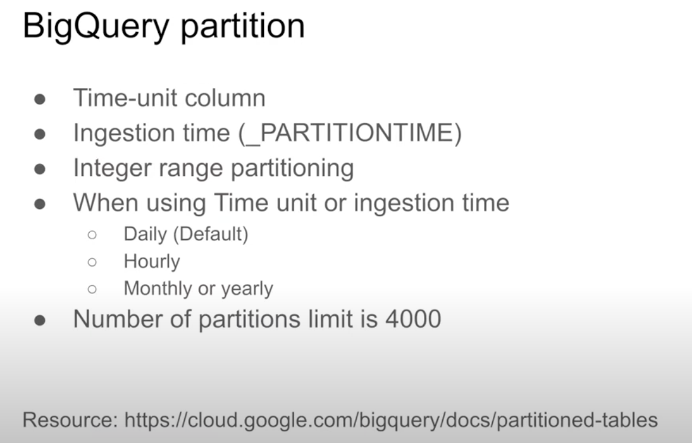
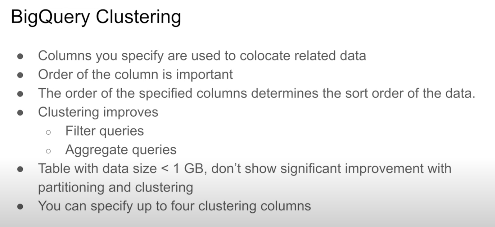
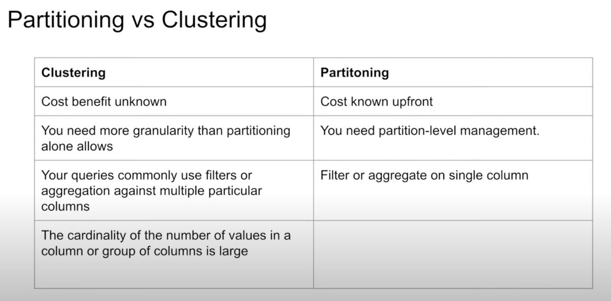
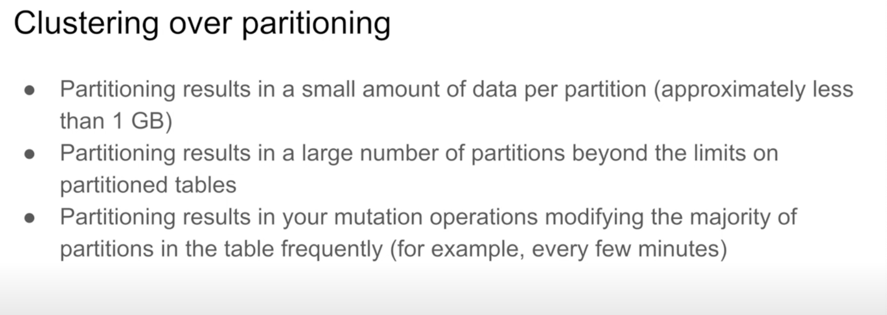

# NOTES

# DWH and BigQuery

Slides and code can be found [here](https://github.com/DataTalksClub/data-engineering-zoomcamp/tree/main/03-data-warehouse)

DWH is an OLAP solution used for analysis and reporting, whereas OLTP is for transactions. The main differences are
- OLAP is column based, better for analytics, and has infrequent but large updates
- OLTP is row based, better for serving small amounts of data quickly, and has frequent small updates

BigQuery (BQ) is a DWH solution, that is serverless i.e. no servers to manage or database software to install

## BigQuery

I won't document everything here since I'm already familiar with BQ and there's information in the de-zoomcamp repo (linked above). I'll just document what I didn't know

### External tables e.g. GCS
We can create a table from a CSV in a bucket with 

```sql
CREATE OR REPLACE EXTERNAL TABLE
OPTIONS (
    format = "CSV,
    uris = ["gs://bucket-name/folder-name/pattern-filename*.csv", "gs://bucket-name/folder-name/some-other-pattern-filename*.csv"]
)
```

### Partitioning data

We can partition data in BQ tables, e.g on partition date, and this will generally improve efficiency of queries that are filtered by the partition column, since BQ will not touch/scan any data in the other partitions

We can create a partitioned table with

```sql
-- Create a partitioned table from external table
CREATE OR REPLACE TABLE taxi-rides-ny.nytaxi.yellow_tripdata_partitoned
PARTITION BY
  DATE(tpep_pickup_datetime) AS
SELECT * FROM taxi-rides-ny.nytaxi.external_yellow_tripdata;
```

We can check the partition sizes with

```sql
-- Let's look into the partitons
SELECT table_name, partition_id, total_rows
FROM `nytaxi.INFORMATION_SCHEMA.PARTITIONS`
WHERE table_name = 'yellow_tripdata_partitoned'
ORDER BY total_rows DESC;
```

You can only partition on a single column and there's a limit of 4000 partitions per table



### Clustering data

Clustering rows together e.g. on a categorical column, means that rows with the same value will be next to each other. This helps with speed and cost of our queries

If we're filtering on a particular column, clustering by this column will speed things up

We can cluster with

```sql
-- Creating a partition and cluster table
CREATE OR REPLACE TABLE taxi-rides-ny.nytaxi.yellow_tripdata_partitoned_clustered
PARTITION BY DATE(tpep_pickup_datetime)
CLUSTER BY VendorID AS
SELECT * FROM taxi-rides-ny.nytaxi.external_yellow_tripdata;
```

Partitioning and clustering should generally be used for larger amounts of data as they have some cost overhead

You can define up to 4 clustering columns, and the order matters



BQ automatically reclusters data as new data is added at no additional cost

### Clustering vs Partitioning

There are pros and cons of each



When to use clustering vs partitioning



### Best practices

Reducing cost:
- Only select columns you need (BQ is column-based)
- Use partitioned / clustered tables where possible
- Price queries before running them (e.g. check the bytes, use a chrome plugin, do a python dry run)
- Materalise query results in stages (see [example below](#materialise-query-results-in-stages))

Improve performance:
- Filter on partitioned or clustered columns
- Use external data sources appropriately
- Denormalise data (see [example below](#denormalising-data))
- Reduce data before using a join (see [example below](#reduce-data-before-join))
- Do not treat WITH clauses as prepared statements (see [example below](#with-clauses))
- Avoid oversharding tables (see [example below](#oversharding-tables))
- Use [approximate aggregate functions](https://cloud.google.com/bigquery/docs/reference/standard-sql/approximate_aggregate_functions#:~:text=Approximate%20aggregate%20functions%20are%20scalable,but%20also%20introduce%20statistical%20uncertainty.)
- [Optimise order by clause](https://cloud.google.com/bigquery/docs/best-practices-performance-compute#optimize_the_order_by_clause)
- [Optimise join patterns](https://cloud.google.com/bigquery/docs/best-practices-performance-compute#optimize_your_join_patterns)

Since these are a bit vague, I tried to find some examples and more documentation below. There's also a lot of other ways to optimise apparently lol

#### Denormalising data

[Denormalied data - Example](https://techtarget.com/searchdatamanagement/definition/denormalization) -> The example used is:

"Imagine a fruit seller has a daily list of what fruit is in stock in their stand and a daily list of the market prices for all fruits and vegetables. This would be two separate tables in a normalized database. If a customer wanted to know the price of an item, the seller would need to check both lists to determine if it is in stock and at what price. This would be slow and annoying.

Therefore, every morning, the seller creates another list with just the items in stock and the daily price, combining the two lists as a quick reference to use throughout the day. This would be a denormalized table for speeding up reading the data.

An important consideration for normalizing data is if the data will be read heavy or write heavy. Because data is duplicated in a denormalized database, when data needs to be added or modified, several tables will need to be changed. This results in slower write operations.

Therefore, the fundamental tradeoff becomes fast writes and slow reads in normalized databases versus slow writes and fast reads in denormalized."

I also found [this nice, albeit long, post]( https://cloud.google.com/blog/topics/developers-practitioners/bigquery-explained-working-joins-nested-repeated-data) from google about denormalisation and repeated / nested data

#### Reduce data before join

[Reduce data before using a join](https://cloud.google.com/bigquery/docs/best-practices-performance-compute#reduce_data_before_using_a_join) -> The example uses the fact that doing group by operations is slow because the data is shuffled. The general advice is to do group bys as late and seldom as possible, but it does suggest that, if doing a group by before joining will reduce the amount of data needed to be joined, then this will speed up the result. 

Another example is shown in this [https://cloud.google.com/blog/topics/developers-practitioners/bigquery-admin-reference-guide-query-optimization] which has some pretty good tips:

"1. Largest table first:  BigQuery best practice is to manually place the largest table first, followed by the smallest, and then by decreasing size. Only under specific table conditions does BigQuery automatically reorder/optimize based on table size.
2. Filter before joins: WHERE clauses should be executed as soon as possible, especially within joins, so the tables to be joined are as small as possible. We recommend reviewing the query execution details to see if filtering is happening as early as possible, and either fix the condition or use a subquery to filter in advance of a JOIN.
3. Pre-aggregate to limit table size: As mentioned above, aggregating tables before they are joined can help improve performance - but only if the amount of data being joined is drastically reduced and tables are aggregated to the same level (i.e., if there is only one row for every join key value).
4. Clustering on join keys: When you cluster a table based on the key that is used to join, the data is already co-located which makes it easier for workers to split the data into the necessary partitions within the memory shuffle."

#### Materialise query results in stages

I found another [google documentation](https://cloud.google.com/bigquery/docs/best-practices-costs#materialize_query_results_in_stages) on that. Essentially, it's cheaper to actually materialize parts of the query, which I understand to mean that the data should be written to a table or a [materialised view](https://cloud.google.com/bigquery/docs/materialized-views-intro), than to run a massive query mutltiple times:

"If you create a large, multi-stage query, each time you run it, BigQuery reads all the data that is required by the query. You are billed for all the data that is read each time the query is run.

Instead, break your query into stages where each stage materializes the query results by writing them to a destination table. Querying the smaller destination table reduces the amount of data that is read and lowers costs. The cost of storing the materialized results is much less than the cost of processing large amounts of data."

#### WITH clauses

I couldn't find much information about the concept of a "prepared statement", but this [google post](https://cloud.google.com/blog/topics/developers-practitioners/bigquery-admin-reference-guide-query-optimization) mentioned something that I think is the general idea:

"Multiple WITH clauses: The WITH statement in BigQuery is like a Macro. At runtime the contents of the subquery will be inlined every place the alias is referenced. This can lead to query plan explosion as seen by the plan executing the same query stages multiple times. Instead, try using a TEMP table."

The [documentation for with clauses](https://cloud.google.com/bigquery/docs/reference/standard-sql/query-syntax#with_clause) mentions that they contain as CTEs (Common Table Expressions) which "acts" like a temporary table. But it is noted [here](https://cloud.google.com/bigquery/docs/reference/standard-sql/query-syntax#with_clause) that "WITH clauses with common table expressions (CTEs) are used for query readability, not performance. There is no guarantee that adding a WITH clause causes BigQuery to materialize temporary intermediate tables and reuse the temporary result for multiple references. The WITH clause might be evaluated multiple times within a query, depending on query optimizer decisions.". 

#### Oversharding tables

I originally thought sharding meant partitioning, but it's not that. The [documentation](https://cloud.google.com/bigquery/docs/best-practices-performance-compute#avoid-oversharding-tables) states that "Table sharding refers to dividing large datasets into separate tables and adding a suffix to each table name. If you are sharding tables by date, use time-partitioned tables instead." So basically partitioning is better if the idea is to join and filter on these tables