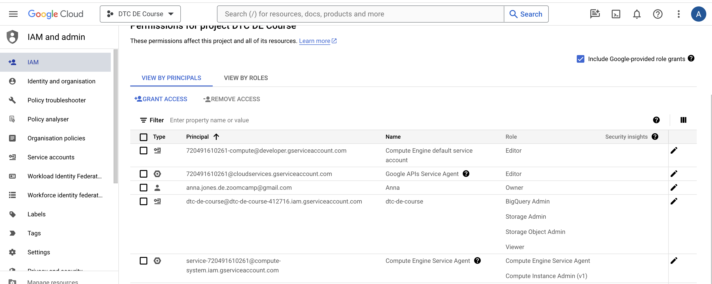
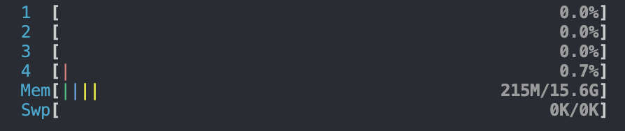
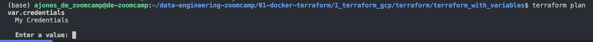

# de-zoomcamp
Repo for my work on the DataTalksClub Data Engineering Zoomcamp

# Week 1 

- [Docker Notes](./01-docker/README.md)
- [Terraform Notes](./01-terraform/README.md)

## Setting up a VM and SSH Key

[Youtube video](https://www.youtube.com/watch?v=ae-CV2KfoN0&list=PL3MmuxUbc_hJed7dXYoJw8DoCuVHhGEQb&index=14)

1. Initialise the gcloud CLI. I already have one set up for work, but it prompts you to create another one

```bash
gcloud init
```

- I called it `de-zoomcamp` and logged in with that email address
- I set the default zone to `europe-west4-a` (Netherlands) in region `europe-west4`, but I could change it with 
```bash
gcloud config set compute/zone NAME
gcloud config set compute/region NAME
```

2. Generate an SSH key ([docs](https://cloud.google.com/compute/docs/connect/create-ssh-keys))

```bash
ssh-keygen -t rsa -f ~/.ssh/de_zoomcamp -C ajones_de_zoomcamp -b 2048
```

Now we will add our public key to GCP

3. Add the SSH key to our GCP project

Normally I would add them via gcloud CLI, but following along with the video, we will be adding the SSH keys directly to the [project metadata](https://cloud.google.com/compute/docs/connect/add-ssh-keys#add_ssh_keys_to_project_metadata).

NOTE: It does warn against doing this in the documentation, but since we're the only ones with access to the project, I think it should be ok for the course

The advantage of this method seems to be that this SSH will grant access to all VMs in the project, so we don't have to add it VM by VM.

Go to GCP > Compute Engine > Metadata > [SSH Keys](https://console.cloud.google.com/compute/metadata?project=dtc-de-course-412716&tab=sshkeys)

Copy the **public key** `de_zoomcamp.pub` to the clipboard (I use `pbcopy < de_zoomcamp.pub`) and add it as a new SSH key

4. Create a VM

- I set Netherlands for the region (Zurich was more expensive)
- I chose `e2-standard-4` (4 cores, 16GB Memory)
- I changed boot disk to Ubuntu 20.04, 30GB

What's pretty cool is that, at the bottom you can see the equivalent code, both for the gcloud CLI and Terraform. I saved these in [bash](./create_vm.sh) and [tf](./create_vm.tf) files just for my own record

5. Create an instance schedule

Because I'm so paranoid about forgetting to shut down my VMs, I've also set up an [instance schedule](https://console.cloud.google.com/compute/instances/instanceSchedules?onCreate=true&project=dtc-de-course-412716&tab=instanceSchedules) to shut down my VM every day at 1am, just in case

Then I [attached this VM to the schedule](https://console.cloud.google.com/compute/instanceSchedulePolicies/details/regions/europe-west4/resourcePolicy/de-zoomcamp-shutdown?project=dtc-de-course-412716)


NOTE: I got an error that a service account didn't have the right permissions, so I had to go to IAM, click "Include Google-provided role grants", edit the principal for the "service-720491610261@compute-system.iam.gserviceaccount.com" account (note the "service-" at the beginning), and add the permissions for "Compute Instance Admin (v1)"



6. Connect

```bash
ssh -i ~/.ssh/de_zoomcamp ajones_de_zoomcamp@35.204.66.238
```

We can see what kind of machine we have:

```bash
htop
```

We see that we have 4 cores (the horizontal bars) and about 16GB of memory


We can also set up our `~/.ssh/config`

```
Host de-zoomcamp
    HostName 35.204.66.238
    IdentityFile /Users/anna.jones/.ssh/de_zoomcamp
    User ajones_de_zoomcamp
```

Now we can just run `ssh de-zoomcamp` to SSH into our machine.

We can also set up VSCode to SSH in. We need to install the Remote SSH extension and then you will see a little >< or lightning bolt looking symbol in the bottom left of VSCode.

We can "Connect to Host" and select our de-zoomcamp config and it will open a new window and connect to the machine. This is easier for coding and viewing files etc


7. Set up the machine

- Install Anaconda. Google "Download Anaconda", go to https://www.anaconda.com/download and scroll down until you see the Linux version. Right click and copy the URL and install it from our SSH terminal

```bash
wget https://repo.anaconda.com/archive/Anaconda3-2023.09-0-Linux-x86_64.sh
bash Anaconda3-2023.09-0-Linux-x86_64.sh 
```

- Install Docker. Run `docker` and we'll see that we don't have it installed, but it will suggest how to install it

```bash
sudo apt-get update
sudo apt-get install docker.io
```

If we get a notice about "E: Package 'docker.io' has no installation candidate" then we need to run apt-get update before we try to install it.

If we try to run it with `docker run hello-world` we get an error, so we need to [configure docker to run without sudo](https://docs.docker.com/engine/install/linux-postinstall/)

```bash
sudo groupadd docker
sudo usermod -aG docker $USER
newgrp docker
docker run hello-world
```

- Install docker compose. So we go to the [docker compose github repo > Releases](https://github.com/docker/compose/releases/tag/v2.24.5) and look for *-linux-x86_64

Let's set up a folder for the executables and install it there

```bash
mkdir bin
cd bin
wget https://github.com/docker/compose/releases/download/v2.24.5/docker-compose-linux-x86_64 -O docker-compose
chmod +x docker-compose
./docker-compose version
```

In order to not have to cd into bin every time, we can add bin to the path in our .bashrc file

```bashrc
export PATH=$HOME/bin:$PATH
```

And update the .bashrc file
```bash
source ~/.bashrc
```

- Clone the course github repo

```bash
git clone https://github.com/DataTalksClub/data-engineering-zoomcamp.git
```

- Run the docker compose file from week 1

```bash
cd data-engineering-zoomcamp/01-docker-terraform/2_docker_sql/
docker-compose up -d # detached mode
docker ps
```

- Install pgcli

```bash
pip install pgcli
pgcli -h localhost -u root -d ny_taxi
```

Check that it works with `\dt` and exit with Ctrl-D

- Forward the port of our postgres machine

Go to the VSCode window that is connected to the VM, open the Terminal window, Click "Ports", "Forward a Port" and add 5432. You should see localhost:5432 added there. If you see something else, you probably are forwarding from your host machine instead of the VM

Now we can check that we can access our postgres from our local terminal i.e. outside of the VM

```bash
pgcli -h localhost -u root -d ny_taxi
```

If we run `\dt` we might see tables. This is because we're accessing our local postgres DB instead. List the docker containers with `docker ps` and kill the containers

Now we can retry and should see an empty DB

We can connect to pgAdmin by forwarding the port 8080 and connecting to http://localhost:8080/ in the browser

We could now run our `ingest_data.py` script in the VM, for example, to create the tables, although I won't do it now.

- Install Terraform

We can find instructions [here](https://developer.hashicorp.com/terraform/tutorials/aws-get-started/install-cli). For some reason, the course says it's better to just download the zip file which we can find by going [here](https://developer.hashicorp.com/terraform/install) and copying the link for [Ubuntu > AMD64](https://releases.hashicorp.com/terraform/1.7.2/terraform_1.7.2_linux_amd64.zip)

```bash
wget https://releases.hashicorp.com/terraform/1.7.2/terraform_1.7.2_linux_amd64.zip -O ~/bin/terraform_1.7.2_linux_amd64.zip
sudo apt-get install unzip
cd ~/bin
unzip terraform_1.7.2_linux_amd64.zip # This creates an executable called "terraform"
rm terraform_1.7.2_linux_amd64.zip
```

We can check that it works with `terraform --version`

- Copy the service account creds

If we want to run our terraform scripts, we would first need to copy the service account credentials to the machine. We can do this with `sftp` and the name of our SSH alias for the VM

```bash
cd 01-terraform/keys
sftp de-zoomcamp
mkdir .keys
cd .keys
put service_account.json
```

I'm not sure why we couldn't just drag the file from our local VSCode window to the one for the VM... might need to check this

- Authenticate with gcloud

For whatever reason, we now need to authenticate with this service account, according to the [course video](https://youtu.be/ae-CV2KfoN0?feature=shared&t=2539). I'm not going to do this now, I think it's not needed for Terraform (since we just pass the path to the service account JSON file), and then I'll see later where / if it's needed if I get an authentication error

```bash
export GOOGLE_APPLICATION_CREDENTIALS=~/.keys/service_account.json
gcloud auth activate-service-account --key-file $GOOGLE_APPLICATION_CREDENTIALS
```

- Test terraform

```bash
cd 01-docker-terraform/1_terraform_gcp/terraform/terraform_with_variables/
```

NOTE: We have some defaults in the `variables.tf` file. If we remove these, we will be prompted in the command line instead e.g. 

```terraform
variable "credentials" {
  description = "My Credentials"
  #ex: if you have a directory where this file is called keys with your service account json file
  #saved there as my-creds.json you could use default = "./keys/my-creds.json"
}


variable "project" {
  description = "Project"
}
```



- Shut down the VM

We can either stop the instance via the UI or with

```bash
sudo shutdown now
```